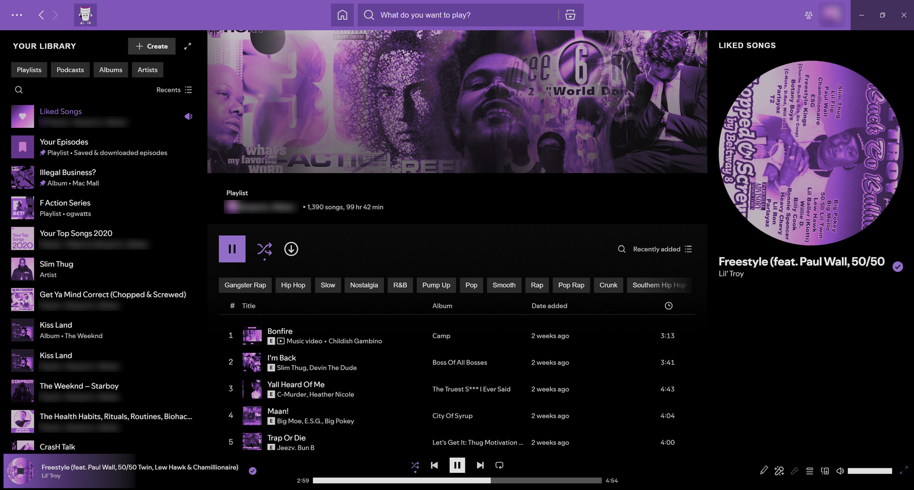

# Biekdafreak - Purple Drank

A black-and-purple [Spicetify](https://spicetify.app) theme with square edges and one purple accent.



## What it does

- Solid black background, purple (`#744DA9`) accents, square corners, no shadows or blur
- Every album cover and artist photo tinted purple
- Purple top bar with darker purple buttons, and a purple cup on the Marketplace button
- **Liked Songs** page gets a full-width banner built from album covers of the artists you've liked the most songs by
- **Spicy Lyrics** support: light purple lyrics page, readable dark buttons, black Now Playing panel
- **Cover Ambience** support: the playbar glow is purple instead of taken from the cover

For the flat light purple Spicy Lyrics page, set Spicy Lyrics' **Static Background** to **Color**. With it off, you get the animated cover art tinted purple instead.

## Install

**Marketplace:** search for *Purple Drank* in the Themes tab.

**Manually:**

```bash
git clone https://github.com/Biekdafreak/spicetify-purple-drank "$(dirname "$(spicetify -c)")/Themes/Biekdafreak - Purple Drank"
spicetify config current_theme "Biekdafreak - Purple Drank" color_scheme purple
cp "$(dirname "$(spicetify -c)")/Themes/Biekdafreak - Purple Drank/extensions/likedSongsBanner.js" "$(dirname "$(spicetify -c)")/Extensions/"
spicetify config extensions likedSongsBanner.js
spicetify apply
```

## License

Code (CSS and JavaScript): MIT, see [LICENSE](LICENSE).
The cup artwork (`assets/cart-cup.png`, embedded in `user.css`) is included by permission of its rights holder and is not covered by the MIT license.
